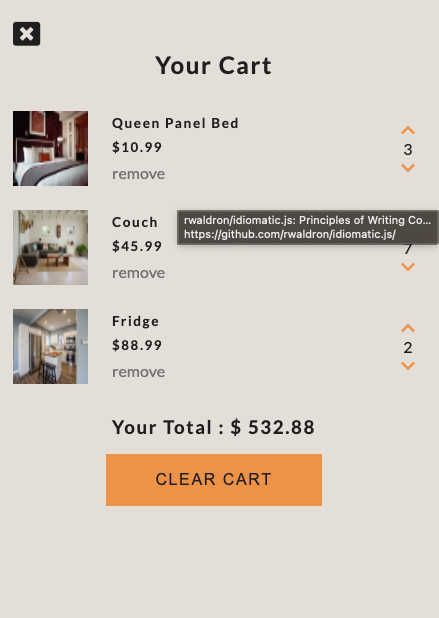

# COMFY HOUSE

A simple Shopping Cart that uses VanillaJs, HTML, and CSS.

<h1>Navbar and Banner</h1>
  
  <h1>Products</h1>
  
  <h1>Cart</h1>
    

## Features

HTML

CSS

VANILLAJS

FONTAWESOME

GOOGLE FONTS
